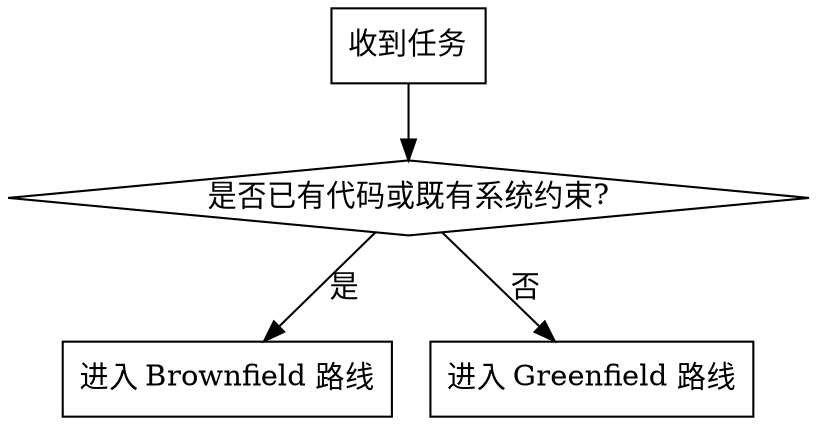
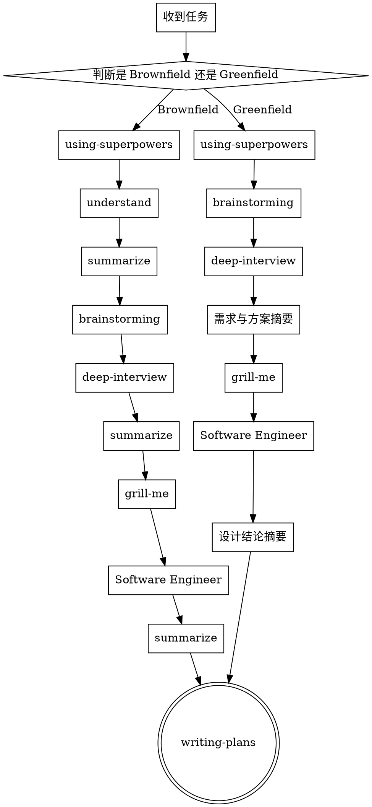

# 业务开发执行前流程

## 概述

这个 skill 用于“开始写代码之前”的业务开发 / 产品开发准备阶段。

只处理 execution 之前的准备流程。目标是：

- 先判断任务属于 `brownfield` 还是 `greenfield`
- 用 `brainstorming` 发散需求、候选方案、候选架构和候选技术路线
- 用 `deep-interview` 收敛歧义，明确边界、非目标和决策条件
- 用 `grill-me` 压力测试当前方向，暴露风险、冲突和遗漏
- 用 `Software Engineer` 正式沉淀 architecture、技术选型和测试策略
- 最后交接给 `writing-plans`

不要在这个流程里使用 `ralplan`。
不要把 `prompt-master` 当成通用前置步骤。

- `brainstorming` 负责发散需求、候选方案、候选架构、候选技术路线
- `deep-interview` 负责收敛歧义、明确边界、非目标和决策条件
- `grill-me` 负责反向拷打方案，暴露风险和遗漏
- `Software Engineer` 负责正式架构设计、技术选型和测试策略
- `writing-plans` 负责把稳定方案转成实施计划

## 路由规则

先判断走哪条路线：

- **Brownfield**：已有代码、已有系统、已有产品约束，要在现有基础上扩展或修改
- **Greenfield**：从 0 开始、需求还模糊、还没有现成实现可分析

使用下面的判断流程：

## 主流程规则

### Brownfield / 现有项目扩展

按这个顺序调用 skills：

1. `using-superpowers`
2. `understand`
3. `summarize`
4. `brainstorming`
5. `deep-interview`
6. `grill-me`
7. `Software Engineer`
8. `summarize`
9. `writing-plans`

说明：

- 先 `understand`，避免在不了解现状时就开始错误提问
- 再 `brainstorming` 和 `deep-interview`，先发散后收敛
- 再 `grill-me` 和 `Software Engineer`，让方案经得起挑战并沉淀为正式设计
- 最后 `writing-plans` 输出实施计划

### Greenfield / 从 0 开始

按这个顺序调用 skills：

1. `using-superpowers`
2. `brainstorming`
3. `deep-interview`
4. `summarize`
5. `grill-me`
6. `Software Engineer`
7. `summarize`
8. `writing-plans`

说明：

- 没有现有代码可理解，所以先从 `brainstorming` 开始
- 先把需求、流程、候选架构、技术路线发散出来
- 再用 `deep-interview` 压缩歧义
- 再用 `grill-me` 和 `Software Engineer` 完成设计收口
- 最后交给 `writing-plans`

## 完整流程图

## 阶段说明

### 1. 项目与上下文理解

`understand` 只用于 brownfield。目标是在开始用户侧设计提问前，先识别当前 architecture、existing patterns 和 technical constraints。

输出应至少包含：

- 项目结构摘要 `project structure summary`
- 关键模块与边界 `important modules and boundaries`
- 当前技术栈与依赖约束 `current stack and dependency constraints`
- 本次需求最可能触及的位置 `likely touchpoints for the requested work`

### 2. 发散阶段

在锁定方案前先用 `brainstorming` 发散。

必须覆盖这些问题：

- 用户目标或业务目标 `user or business goal`
- 目标用户或内部 stakeholder `target users or internal stakeholders`
- 主要流程或功能表面 `main workflow or feature surface`
- 成功标准 `success criteria`
- 候选架构方向 `candidate architecture shapes`
- 候选技术路线 `candidate technical directions`
- 已知约束 `constraints that are already known`

如果存在多个可行方向，给出 2-3 个可行方案 `viable approaches`，并说明取舍 `trade-offs` 和推荐结论。

- 不是直接下结论
- 要主动提出候选方案、候选架构、候选技术路线
- 如果存在多个方向，要明确 trade-offs

### 3. 收敛阶段

`deep-interview` 必须接在 `brainstorming` 之后，用来降低 ambiguity，而不是重复泛泛讨论。

这一阶段要压实：

- 范围 `scope`
- 非目标 `non-goals`
- 决策边界 `decision boundaries`
- 架构假设 `architecture assumptions`
- 技术决策标准 `technical decision criteria`
- 集成约束 `integration constraints`
- 交付约束 `delivery constraints`
- 验收标准 `acceptance criteria`

如果答案能从 code 或 docs 里直接找到，先检索，不要把事实问题甩给用户。

- 这一阶段不是继续发散，而是压缩歧义
- 要明确 scope、non-goals、decision boundaries、acceptance criteria
- 架构和技术问题也要在这里进一步追问，不只问业务需求

### 4. 压力测试阶段

在主要澄清已经稳定后，再使用 `grill-me`。

重点拷打：

- 哪些地方可能出问题
- 哪些内容必须保持在范围之外
- 哪些取舍是不可接受的
- 如果当前 architecture 选错了，会先坏在哪里
- 边界场景和极端场景会发生什么
- 有什么证据能证明设计已经完整到足以进入计划阶段

一次只问一个问题。目标是在 design finalization 之前打掉脆弱假设。

### 5. 正式设计阶段

用 `Software Engineer` 把前面澄清过的方向沉淀成正式 technical design。

至少覆盖：

- 架构 `architecture`
- 模块边界 `module boundaries`
- 依赖方向 `dependency direction`
- API 或 interface 边界
- 存储方案 `storage choices`
- 错误处理 `error handling`
- 测试策略 `testing strategy`
- 技术选型理由 `technology selection rationale`

如果还有多个 viable technical choices，要明确说明：

- 选了什么
- 为什么选它
- 拒绝了什么
- 这个决策应该在什么条件下重新评估

- 这里输出正式的 architecture、module boundaries、technical choices、testing strategy
- 如果技术选型存在多个可行解，必须解释 why this one / why not the others

### 6. 计划生成阶段

在 `writing-plans` 之前，用 `summarize` 把最终 design 压缩成清晰的 planning 输入。

然后调用 `writing-plans`。这里不要进入 execution skills。

## 必问问题组

进入 `writing-plans` 之前，必须明确覆盖以下三组问题。

### 需求问题组

- 业务问题 `business problem`
- 用户或 stakeholder
- 成功定义 `success definition`
- 明确的非目标 `explicit non-goals`
- 固定约束 `fixed constraints`

### 架构问题组

- 系统边界 `system boundary`
- 涉及的模块或组件 `involved modules or components`
- 必须继承的 existing patterns
- 集成点或契约 `integration points or contracts`
- 需要处理的失败模式 `failure modes`

### 技术选型问题组

- 技术栈约束 `stack constraints`
- 依赖策略 `dependency policy`
- 运维、性能、可维护性的取舍 `trade-offs`
- 最简单可行路径 `simplest viable path`
- 被拒绝的选项及原因

- 不允许只问“需求是什么”
- 必须覆盖“怎么设计”和“为什么这么选”
- 这些问题必须在进入 `writing-plans` 之前问清楚

## 输出要求

结束前至少产出：

1. 路由结论：`brownfield` 或 `greenfield`
2. 精炼的需求摘要 `requirements summary`
3. 精炼的架构与技术摘要 `architecture and technology summary`
4. 明确的非目标列表 `explicit non-goals`
5. 风险或假设列表 `open risks or assumptions`
6. 指向 `writing-plans` 的 handoff

## 何时使用 `prompt-master`

只有满足以下情况时才插入 `prompt-master`：

- 你需要给 Claude、Cursor、ChatGPT 或其他外部 AI 工具写专门的 prompt
- 你需要给某个 specialist subagent 写一个边界很紧的 prompt
- 你需要把同一个请求改写成另一种 AI tool 更适合的格式

- `prompt-master` 是局部增强器，不是总控前置器
- 只有在你真的要给外部 AI 或专门子代理写 prompt 时才插入

## 常见错误

- 因为需求看起来简单就跳过 `brainstorming`
- 在 brownfield 工作里跳过 `understand`
- 把 `deep-interview` 用成泛泛的 ideation，而不是做 ambiguity reduction
- 在还没有初步方向时就过早使用 `grill-me`
- 在 architecture 和技术选型还没稳定前就跳进 `writing-plans`
- 把 `prompt-master` 当成强制基础设施

## 结束条件

满足以下条件时，这个 skill 才算完成：

- 请求已经完成分类
- 需求已经澄清
- architecture 和技术选项已经被追问并稳定下来
- 风险和非目标已经被压力测试
- 已经形成最终 design summary
- `writing-plans` 已调用，或已经准备好作为下一步调用
